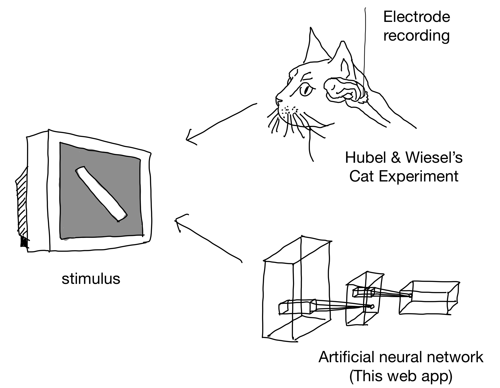

# rf_playground

Let the user map the receptive field of a chosen artificial unit using a bar stimulus, then compare the mapping result with the ground truth map. The web app reduces latency by using ONNX.js to load the neural network and HTML5 Canvas for user interactions. **The website is under construction**.

For local development, consider turning off CORS by typing the following in the terminal (Mac users):

`open -n -a /Applications/Google\ Chrome.app/Contents/MacOS/Google\ Chrome --args --user-data-dir="/tmp/chrome_dev_test" --disable-web-security`

*Note: The command above opens a Chrome window without CORS. Remember to close this window after development. Do not use it to browse unsecure websites (or any websites at all, just to be safe!).*

The web app is deployed [here](https://tonyfu97.github.io/rf_playground/) (powered by GitHub Pages. Chrome is recommended. Audio feedback does not work well on Safari.)

Credit: This work is inspired by [elliotwaite's demo](https://github.com/elliotwaite/pytorch-to-javascript-with-onnx-js)
